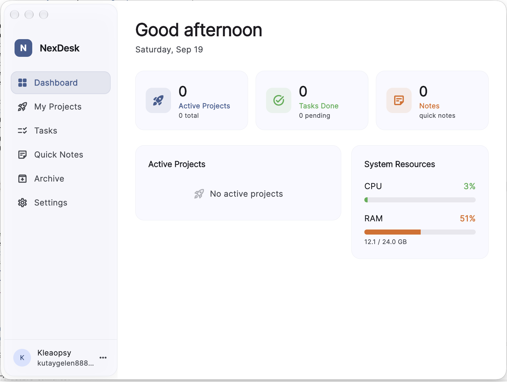
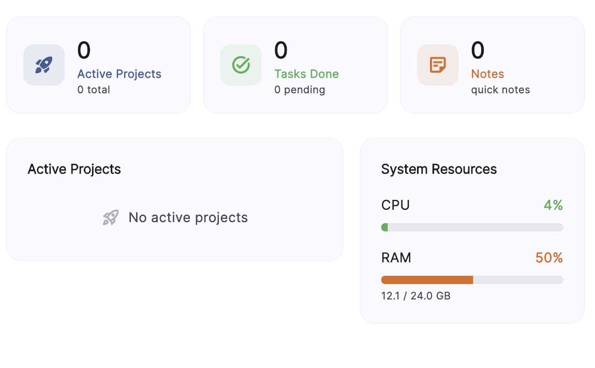
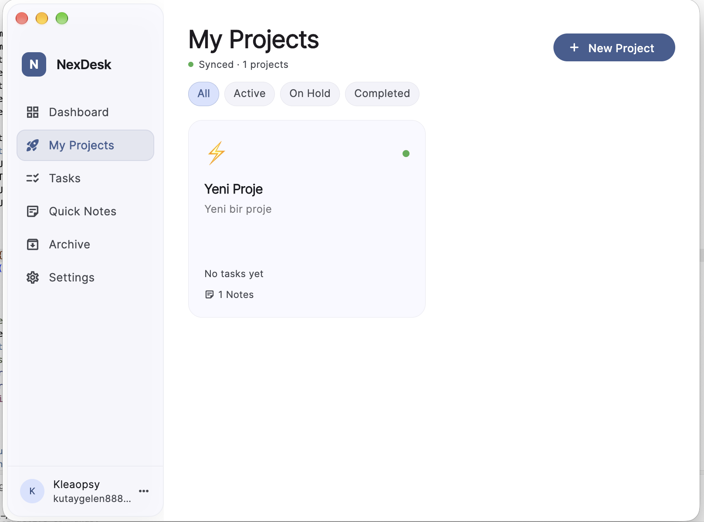
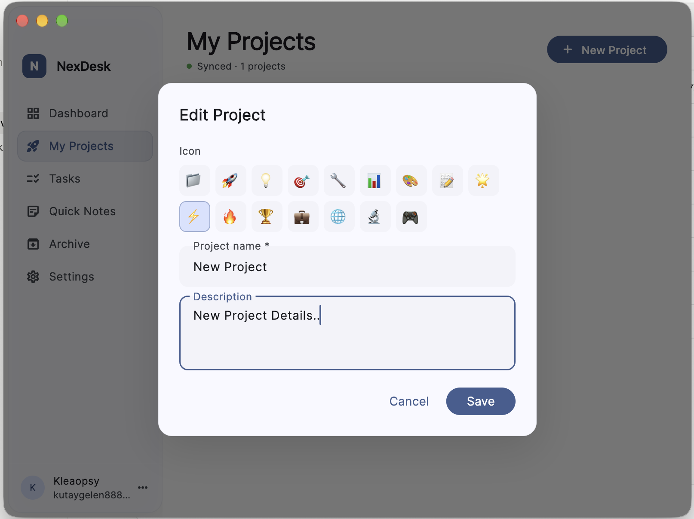
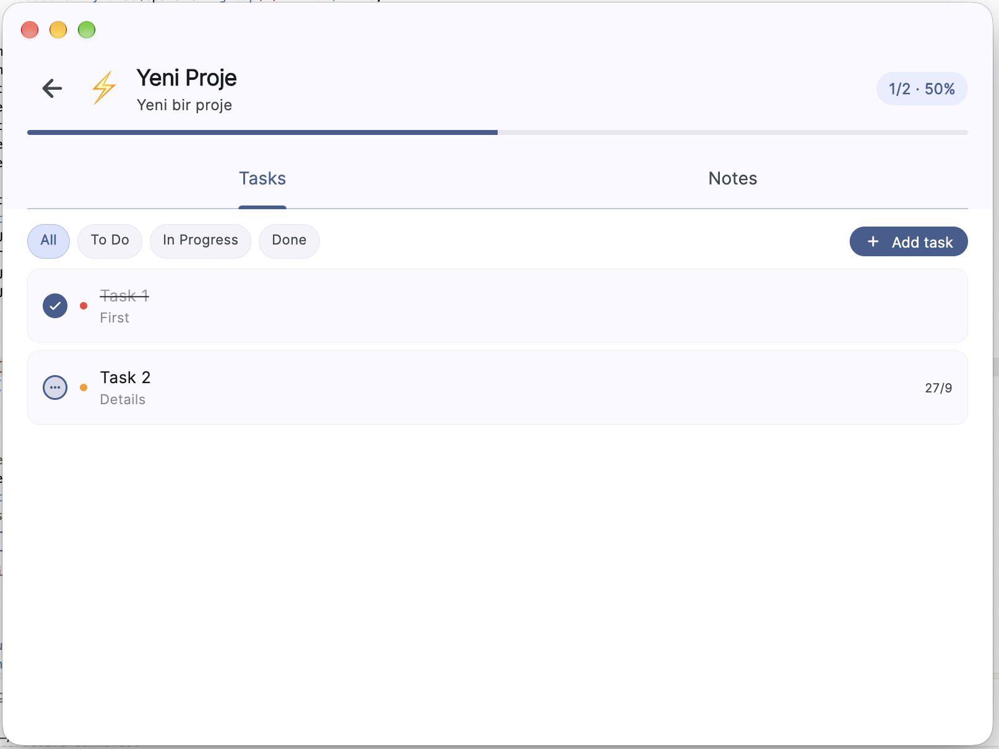
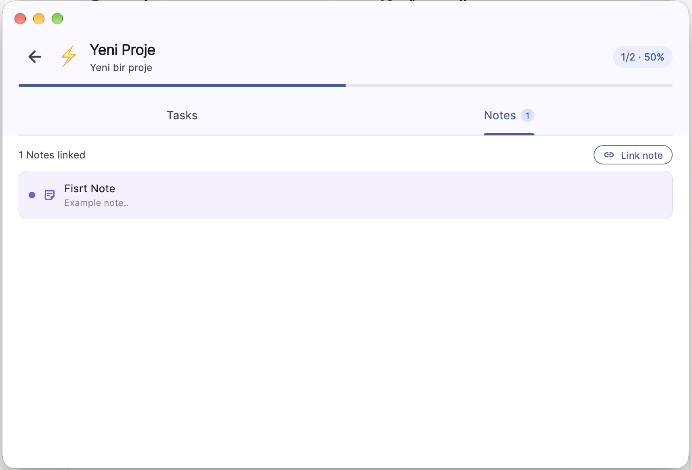
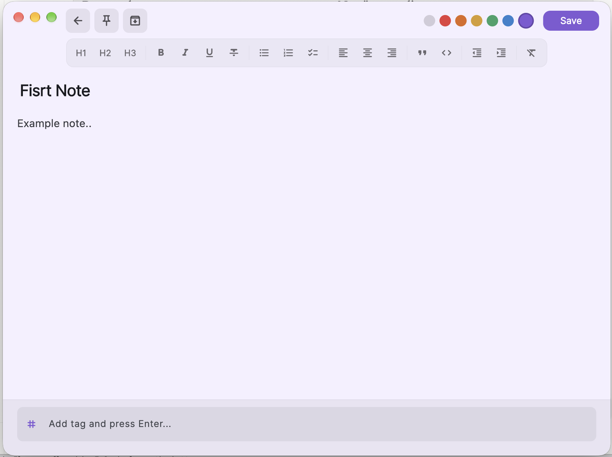
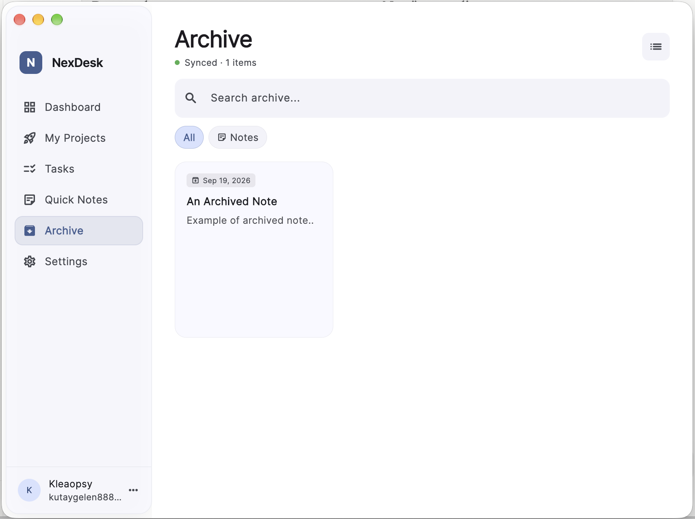
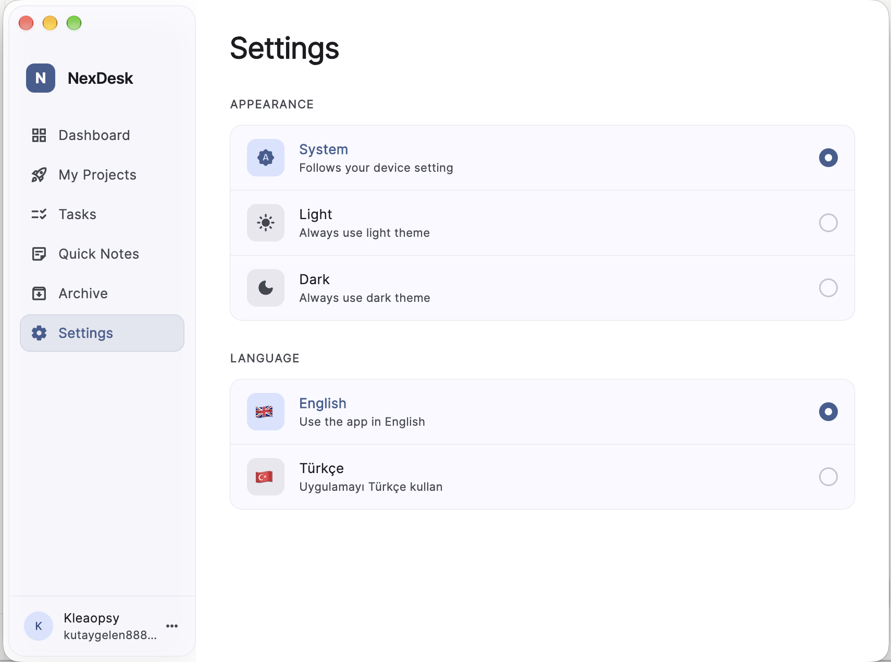

# NexDesk

> A cross-platform productivity desktop app built with Flutter — organize your projects, tasks, and notes in one place, synced across devices via Firebase.



---

## ✨ Features

### 🗂 Dashboard
Real-time overview of your workspace — active projects with progress bars, task summary, upcoming & overdue tasks, and live system resource monitoring (CPU & RAM).



---

### 🚀 My Projects
Create and manage projects with custom emoji, descriptions, and status tracking.

- **Status management:** Active, On Hold, Completed
- **Progress tracking:** Visual progress bar based on completed tasks
- **Linked notes:** Attach quick notes directly to a project
- **Context menu:** Right-click to edit, change status, or delete



#### Project Detail
Each project has a dedicated detail view with two tabs:

**Tasks tab** — Add, edit, filter, and complete tasks with priority levels (High / Medium / Low) and due dates.

**Notes tab** — Link existing notes to the project and view them inline without leaving the project.



---

### ✅ Tasks
Kanban-style board across all your projects.

- Filter by project
- Three columns: To Do / In Progress / Done
- Priority dot indicators and due date badges
- Quick status change on hover



---

### 📝 Quick Notes
A rich-text note editor with a clean, distraction-free design.

- **Rich text formatting:** Bold, Italic, Underline, Strikethrough
- **Headings:** H1, H2, H3
- **Lists:** Bulleted, Numbered, Checklist
- **Alignment:** Left, Center, Right
- **Blocks:** Blockquote, Code block
- **Indent / Outdent**
- **Note colors:** 6 color themes (Red, Orange, Yellow, Green, Blue, Purple)
- **Tags:** Add and filter by custom tags
- **Pin notes** to the top
- **Archive** notes for later
- **Grid / List** view toggle
- Synced to Firestore with offline support





---

### 🗄 Archive
Soft-delete with full recovery — archived notes can be viewed in read-only mode, restored back to Notes, or permanently deleted.



---

### ⚙️ Settings
- **Theme:** System / Light / Dark
- **Language:** English / Turkish (Türkçe)



---

## 🌍 Localization

NexDesk is fully localized in:

| Language | Code |
|----------|------|
| English  | `en` |
| Turkish  | `tr` |

Language preference is saved locally and synced to your Firebase account.

---

## 🛠 Tech Stack

| Layer | Technology |
|-------|-----------|
| Framework | Flutter (Desktop) |
| Language | Dart |
| Auth | Firebase Auth |
| Database | Cloud Firestore |
| Local storage | SharedPreferences |
| Rich text | flutter_quill |
| State | setState + ChangeNotifier |
| Platforms | macOS, Windows |

---

## 📦 Download

### macOS
[](https://github.com/Kleaopsy/NexDesk/releases/latest)

Download the latest `NexDesk-1.0.0.dmg` from [Releases](https://github.com/Kleaopsy/NexDesk/releases), open it and drag NexDesk to your Applications folder.

---

## 🚀 Getting Started

### Prerequisites

- Flutter SDK (3.x or later)
- Xcode (macOS builds)
- A Firebase project with Auth and Firestore enabled

### Installation

```bash
git clone https://github.com/YOUR_USERNAME/nexdesk.git
cd nexdesk
flutter pub get
```

### Firebase Setup

1. Create a Firebase project at [console.firebase.google.com](https://console.firebase.google.com)
2. Enable **Email/Password** authentication
3. Enable **Cloud Firestore**
4. Download `GoogleService-Info.plist` (macOS) and place it in `macos/Runner/`
5. Download `google-services.json` (Windows) and place it in the project root

### Firestore Security Rules

```javascript
rules_version = '2';
service cloud.firestore {
  match /databases/{database}/documents {
    match /users/{userId}/{document=**} {
      allow read, write: if request.auth != null && request.auth.uid == userId;
    }
  }
}
```

### Run

```bash
# macOS
flutter run -d macos

# Windows
flutter run -d windows
```

---

## 📁 Project Structure
lib/
├── app/
│ └── shell.dart # Navigation shell & sidebar
├── core/
│ ├── l10n/
│ │ └── app_strings.dart # EN/TR localization
│ ├── providers/
│ │ └── locale_provider.dart
│ └── services/
│ ├── notes_service.dart
│ ├── project_service.dart
│ └── archive_service.dart
└── features/
├── auth/
├── dashboard/
├── myprojects/
├── tasks/
├── notes/
├── archive/
└── settings/


---

## 📸 Screenshots

| Dashboard | My Projects | Notes |
|-----------|-------------|-------|
|  |  |  |

| Project Detail | Tasks | Archive |
|----------------|-------|---------|
|  |  |  |

---

## 🗺 Roadmap

- [ ] Image & file embedding in notes
- [ ] Windows build polish
- [ ] Dashboard widgets customization
- [ ] Mobile companion app

---

## 📄 License

MIT License — see [LICENSE](LICENSE) for details.

---

<p align="center">Built with ❤️ using Flutter</p>


